---
## Front matter
title: "Лабораторная работа №3"
subtitle: "Система контроля версий Git 3.1"
author: "Гузева Ирина Николаевна"

## Generic otions
lang: ru-RU

## Bibliography
bibliography: bib/cite.bib
csl: pandoc/csl/gost-r-7-0-5-2008-numeric.csl

## Pdf output format
toc: true # Table of contents
toc-depth: 2
lof: true # List of figures
lot: true # List of tables
fontsize: 12pt
linestretch: 1.5
papersize: a4
documentclass: scrreprt
## I18n polyglossia
polyglossia-lang:
  name: russian
  options:
	- spelling=modern
	- babelshorthands=true
polyglossia-otherlangs:
  name: english
## I18n babel
babel-lang: russian
babel-otherlangs: english
## Fonts
mainfont: PT Serif
romanfont: PT Serif
sansfont: PT Sans
monofont: PT Mono
mainfontoptions: Ligatures=TeX
romanfontoptions: Ligatures=TeX
sansfontoptions: Ligatures=TeX,Scale=MatchLowercase
monofontoptions: Scale=MatchLowercase,Scale=0.9
## Biblatex
biblatex: true
biblio-style: "gost-numeric"
biblatexoptions:
  - parentracker=true
  - backend=biber
  - hyperref=auto
  - language=auto
  - autolang=other*
  - citestyle=gost-numeric
## Pandoc-crossref LaTeX customization

## Misc options
indent: true
header-includes:
  - \usepackage{indentfirst}
  - \usepackage{float} # keep figures where there are in the text
  - \floatplacement{figure}{H} # keep figures where there are in the text
---

# Цель работы

Целью работы является изучить идеологию и применение средств
контроля версий. Приобрести практические навыки по работе с системой git.

# Выполнение лабораторной работы

1) Создала учётную запись на сайте https://github.com/ и заполнила основные
данные (рис. [-@fig:001])

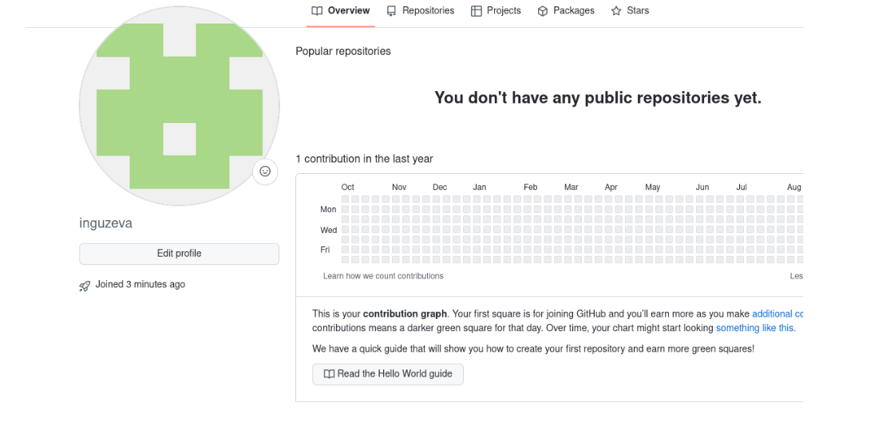{ #fig:001 width=70% }

2) Сделала предварительную конфигурацию git (рис. [-@fig:002])

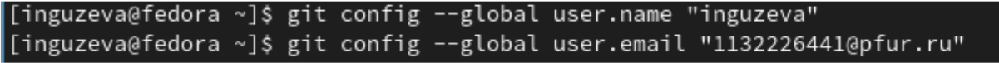{ #fig:002 width=70% }

3) Настроила utf-8 в выводе сообщений git и задала имя начальной ветки (рис. [-@fig:003])

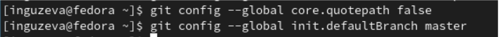{ #fig:003 width=70% }

4) Задала параметры autocrlf и safecrlf (рис. [-@fig:004])

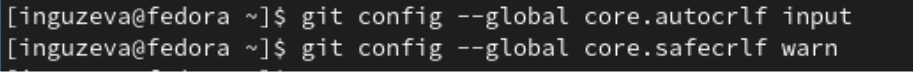{ #fig:004 width=70% }

5) Сгенерировала приватный и открытый ключ (рис. [-@fig:005])

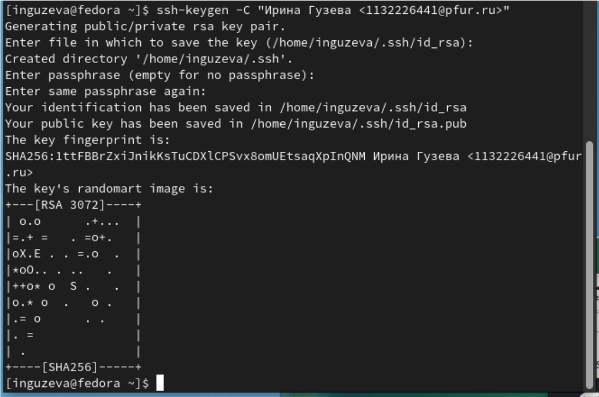{ #fig:005 width=70% }

6) Скопировала и вставила ключ на сайте, сохранила его (рис. [-@fig:006])

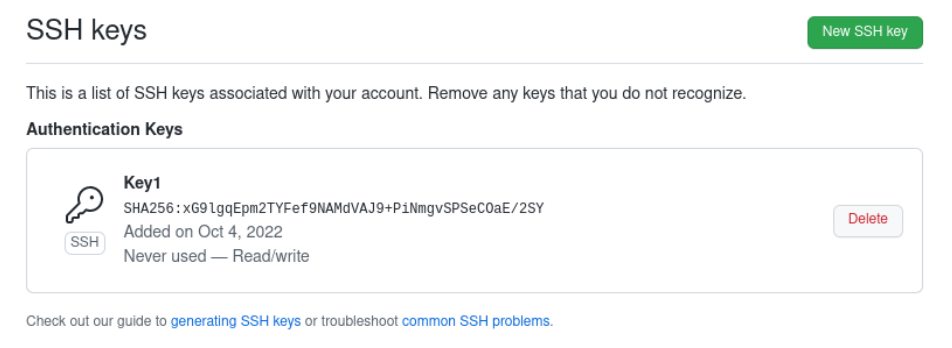{ #fig:006 width=70% }

7) Создала каталог для предмета «Архитектура компьютера» (рис. [-@fig:007])

{ #fig:007 width=70% }

8) Создала репозиторий курса на основе шаблона с названием
study_2022–2023_arh-pc (рис. [-@fig:008])

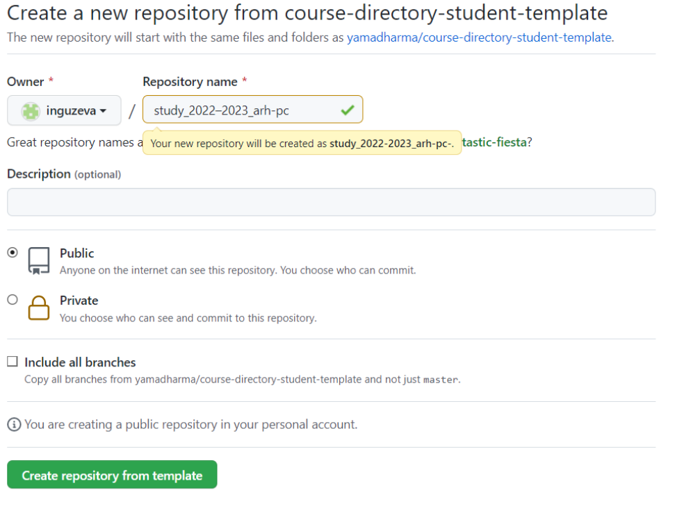{ #fig:008 width=70% }

9) Клонировала созданный репозиторий (рис. [-@fig:009])

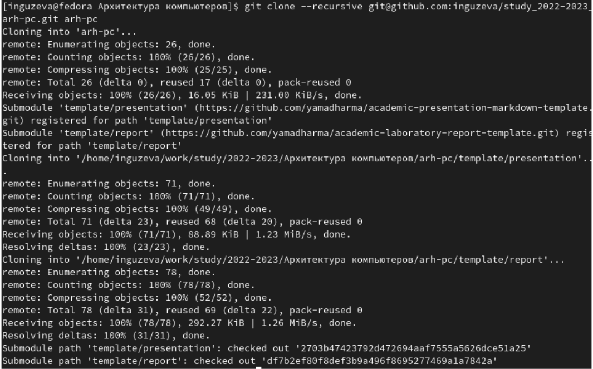{ #fig:009 width=70% }

10) Перешла в каталог курса и удалила лишние файлы (рис. [-@fig:010])

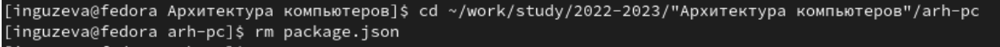{ #fig:010 width=70% }

11) Создала необходимые каталоги (рис. [-@fig:011])

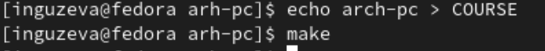{ #fig:011 width=70% }

12) Отправила файлы на сервер (рис. [-@fig:012])

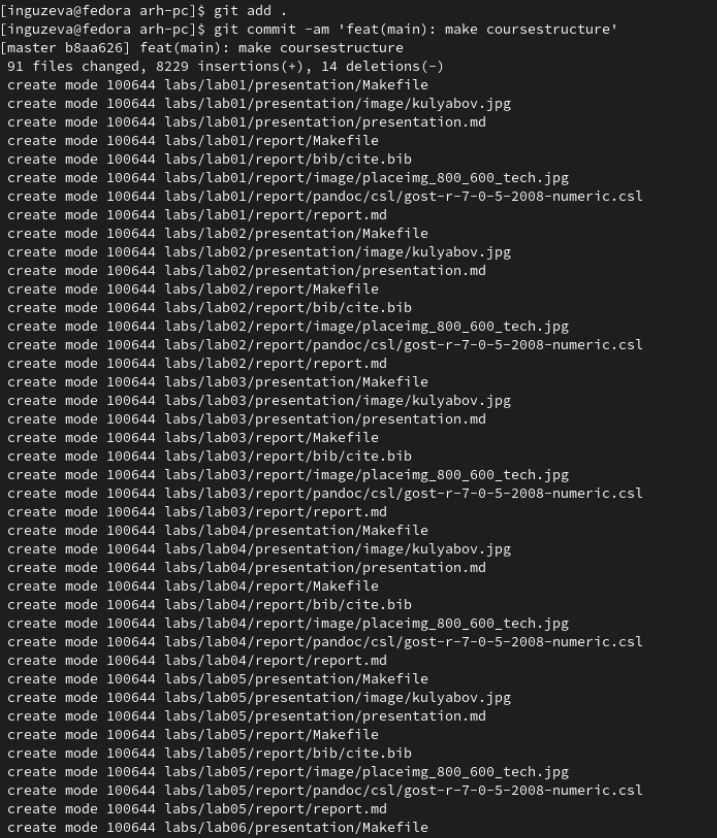{ #fig:012 width=70% }

13) Убедилась в правильности создания иерархии рабочего пространства в
локальном репозитории (рис. [-@fig:013]) и на странице GitHub (рис. [-@fig:014])

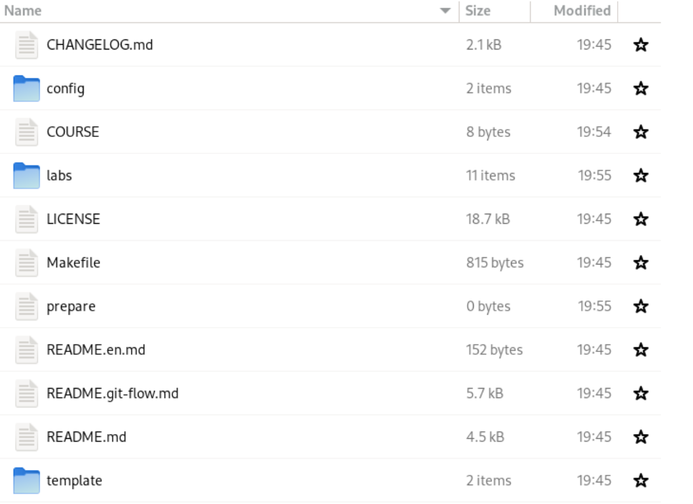{ #fig:013 width=70% }
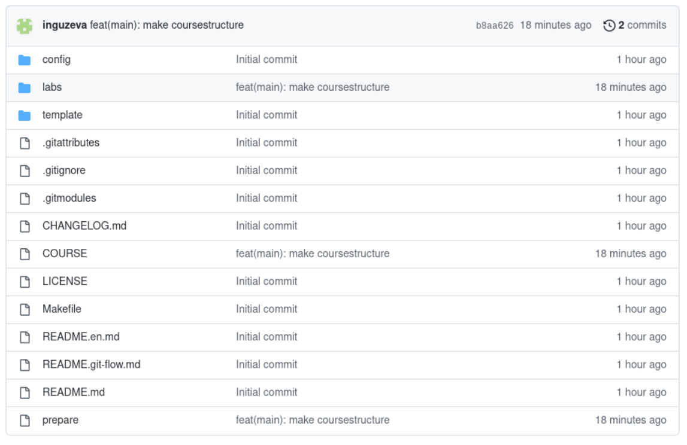{ #fig:014 width=70% }

14) Создала отчет по выполнению лабораторной работы в соответствующем
каталоге рабочего пространства (labs>lab03>report)  (рис. [-@fig:015])

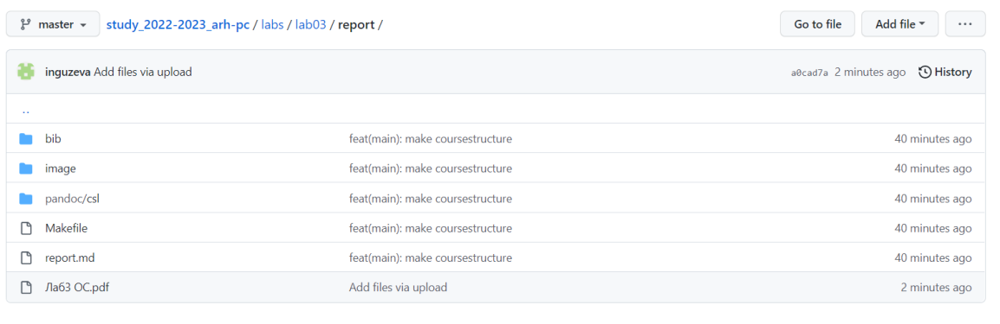{ #fig:015 width=70% }

15) Загрузила отчет по лабораторной работе №2 (рис. [-@fig:016])

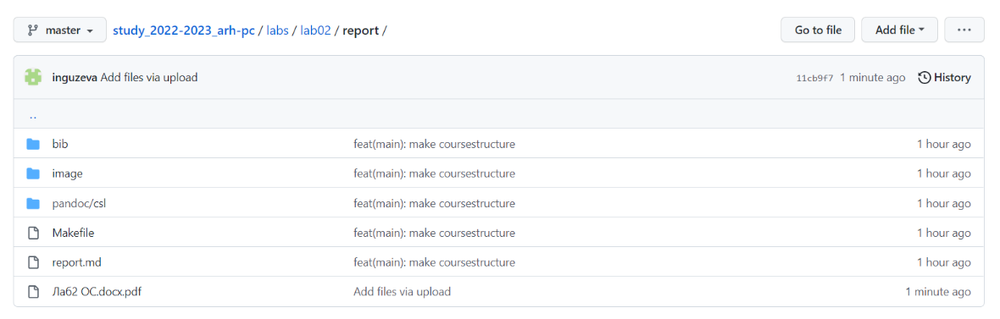{ #fig:016 width=70% }

16) Загрузила отчет по лабораторной работе №1 (рис. [-@fig:017])

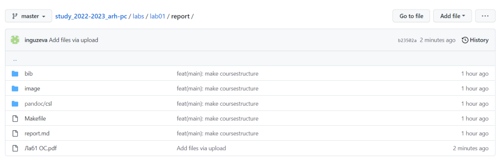{ #fig:017 width=70% }

# Выводы

В ходе лабораторной работы я приобрела практические навыки
по работе с системой git.
