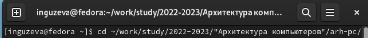
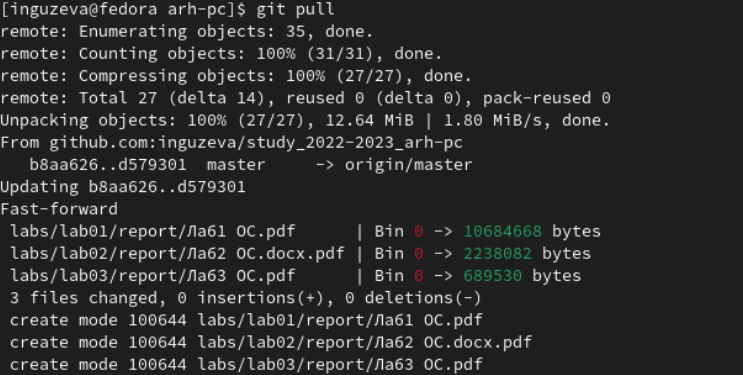
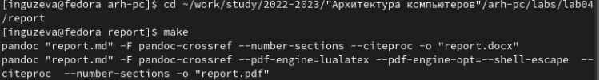
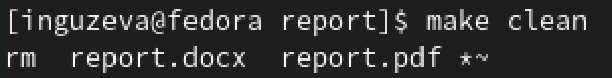
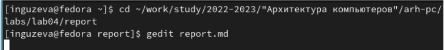
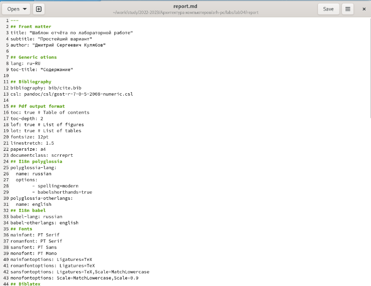

---
## Front matter
title: "Лабораторная работа №4"
subtitle: "Язык разметки Markdown"
author: "Гузева Ирина Николаевна"

## Generic otions
lang: ru-RU

## Bibliography
bibliography: bib/cite.bib
csl: pandoc/csl/gost-r-7-0-5-2008-numeric.csl

## Pdf output format
toc: true # Table of contents
toc-depth: 2
lof: true # List of figures
lot: true # List of tables
fontsize: 12pt
linestretch: 1.5
papersize: a4
documentclass: scrreprt
## I18n polyglossia
polyglossia-lang:
  name: russian
  options:
	- spelling=modern
	- babelshorthands=true
polyglossia-otherlangs:
  name: english
## I18n babel
babel-lang: russian
babel-otherlangs: english
## Fonts
mainfont: PT Serif
romanfont: PT Serif
sansfont: PT Sans
monofont: PT Mono
mainfontoptions: Ligatures=TeX
romanfontoptions: Ligatures=TeX
sansfontoptions: Ligatures=TeX,Scale=MatchLowercase
monofontoptions: Scale=MatchLowercase,Scale=0.9
## Biblatex
biblatex: true
biblio-style: "gost-numeric"
biblatexoptions:
  - parentracker=true
  - backend=biber
  - hyperref=auto
  - language=auto
  - autolang=other*
  - citestyle=gost-numeric
## Pandoc-crossref LaTeX customization
figureTitle: "Рис."
tableTitle: "Таблица"
listingTitle: "Листинг"
lolTitle: "Листинги"
## Misc options
indent: true
header-includes:
  - \usepackage{indentfirst}
  - \usepackage{float} # keep figures where there are in the text
  - \floatplacement{figure}{H} # keep figures where there are in the text
---

# Цель работы

Целью работы является освоение процедуры оформления отчетов
с помощью легковесного языка разметки Markdown.

# Выполнение лабораторной работы

1) Установила TexLive, Pandoc и Pandoc-crossref
2) Открыла терминал и перешла в каталог курса, сформированный при
выполнении лабораторной работы No3 (Рис. 1.1) (рис. [-@fig:001])

{ #fig:001 width=70% }

3) Обновите локальный репозиторий, скачав изменения из удаленного
репозитория с помощью команды git pull (рис. { #fig:002 width=70% }

{ #fig:002 width=70% }

4) Перешла в каталог с шаблоном отчета по лабораторной работе No 4 и
провела компиляцию шаблона с использованием Makefil (рис. [-@fig:003])

{ #fig:003 width=70% }

5) Удалила полученный файлы с использованием Makefile (рис. [-@fig:004])

{ #fig:004 width=70% }

6) Установила gedit и открыла файл report.md с его помощью (рис. [-@fig:005], [-@fig:006])

{ #fig:005 width=70% }

{ #fig:006 width=70% }

7) Заполнила отчёт и скомпилировала его с использованием Makefile
8) Загрузила файлы лабораторной работы №4 на github
9) В соответствующем каталоге сделала отчет по лабораторной работе №3 в формате Markdown
10) Загрузила файлы лабораторной работы №3 на github

# Выводы

В ходе лабораторной работы я освоила процедуру оформления отчетов с помощью языка разметки Markdown

