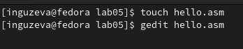
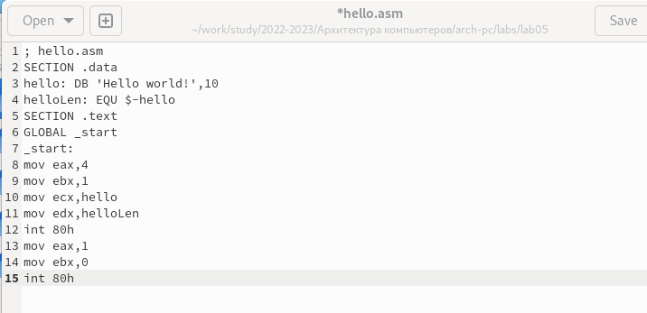
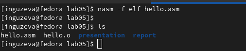
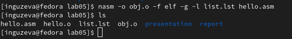
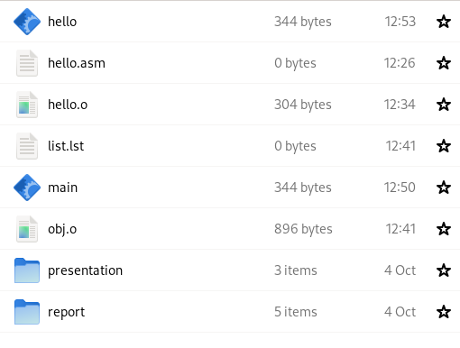
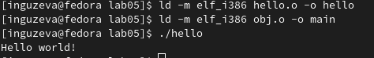
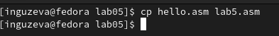
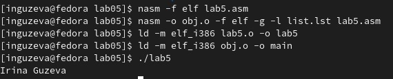

---
## Front matter
title: "Лабораторная работа №5"
subtitle: "Создание и обработка программ на языке ассемблер NASM"
author: "Гузева Ирина Николаевна"

## Generic otions
lang: ru-RU

## Bibliography
bibliography: bib/cite.bib
csl: pandoc/csl/gost-r-7-0-5-2008-numeric.csl

## Pdf output format
toc: true # Table of contents
toc-depth: 2
lof: true # List of figures
lot: true # List of tables
fontsize: 12pt
linestretch: 1.5
papersize: a4
documentclass: scrreprt
## I18n polyglossia
polyglossia-lang:
  name: russian
  options:
	- spelling=modern
	- babelshorthands=true
polyglossia-otherlangs:
  name: english
## I18n babel
babel-lang: russian
babel-otherlangs: english
## Fonts
mainfont: PT Serif
romanfont: PT Serif
sansfont: PT Sans
monofont: PT Mono
mainfontoptions: Ligatures=TeX
romanfontoptions: Ligatures=TeX
sansfontoptions: Ligatures=TeX,Scale=MatchLowercase
monofontoptions: Scale=MatchLowercase,Scale=0.9
## Biblatex
biblatex: true
biblio-style: "gost-numeric"
biblatexoptions:
  - parentracker=true
  - backend=biber
  - hyperref=auto
  - language=auto
  - autolang=other*
  - citestyle=gost-numeric
## Pandoc-crossref LaTeX customization

## Misc options
indent: true
header-includes:
  - \usepackage{indentfirst}
  - \usepackage{float} # keep figures where there are in the text
  - \floatplacement{figure}{H} # keep figures where there are in the text
---

# Цель работы

Освоение процедуры компиляции и сборки программ, написанных на ассемблере NASM.

# Выполнение лабораторной работы

1. Создала текстовый файл с именем hello.asm и открыла его в gedit (рис. [-@fig:001])

{ #fig:001 width=70% }

2. Ввела программу в файл (рис. [-@fig:002])

{ #fig:002 width=70% }

3. Скомпилировала текст программы в код, выводящий 'Hello world' и проверила его наличие с помощью программы ls (рис. [-@fig:003])

{ #fig:003 width=70% }

4. Скомпилировала исходный файл hello.asm в obj.o (рис. [-@fig:004])

{ #fig:004 width=70% }

5. С помощью комповщика ld создала файлы hello, main (рис. [-@fig:005])

{ #fig:005 width=70% }

6. Запустила файл hello (рис. [-@fig:006])

{ #fig:006 width=70% }

7. В каталоге ~/work/arch-pc/lab05 с помощью команды cp создала копию
файла hello.asm с именем lab5.asm (рис. [-@fig:007])

{ #fig:007 width=70% }

8. Изменила строку Hello world! на свои имя и фамилию в программе.

9. Оттранслировала полученный текст программы lab5.asm в объектный
файл. Выполнила компоновку объектного файла и запустила получившийся исполняемый файл. (рис. [-@fig:008])

{ #fig:008 width=70% }

# Выводы

В ходе лабораторной работы я освоила процедуру компиляции и сборки программ, написанных на ассемблере NASM.
