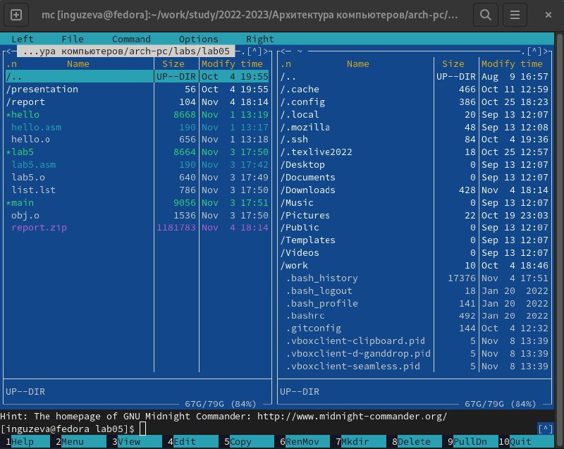
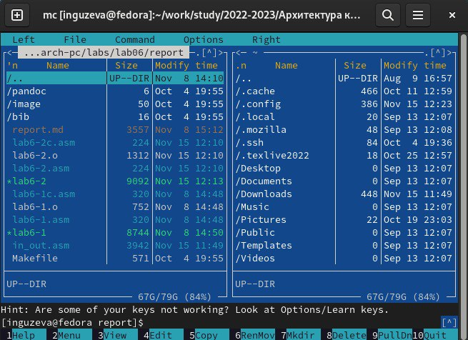

---
## Front matter
title: "Лабораторная работа №6"
subtitle: "Основы работы с
Midnight Commander (mc). Структура
программы на языке ассемблера NASM.
Системные вызовы в ОС GNU Linux
"
author: "Гузева Ирина Николаевна"

## Generic otions

## Bibliography
bibliography: bib/cite.bib
csl: pandoc/csl/gost-r-7-0-5-2008-numeric.csl

## Pdf output format
toc: true # Table of contents
toc-depth: 2
lof: true # List of figures
lot: true # List of tables
fontsize: 12pt
linestretch: 1.5
papersize: a4
documentclass: scrreprt
## I18n polyglossia
polyglossia-lang:
  name: russian
  options:
	- spelling=modern
	- babelshorthands=true
polyglossia-otherlangs:
  name: english
## I18n babel
babel-lang: russian
babel-otherlangs: english
## Fonts
mainfont: PT Serif
romanfont: PT Serif
sansfont: PT Sans
monofont: PT Mono
mainfontoptions: Ligatures=TeX
romanfontoptions: Ligatures=TeX
sansfontoptions: Ligatures=TeX,Scale=MatchLowercase
monofontoptions: Scale=MatchLowercase,Scale=0.9
## Biblatex
biblatex: true
biblio-style: "gost-numeric"
biblatexoptions:
  - parentracker=true
  - backend=biber
  - hyperref=auto
  - language=auto
  - autolang=other*
  - citestyle=gost-numeric
## Pandoc-crossref LaTeX customization

## Misc options
indent: true
header-includes:
  - \usepackage{indentfirst}
  - \usepackage{float} # keep figures where there are in the text
  - \floatplacement{figure}{H} # keep figures where there are in the text
---

# Цель работы

Приобретение практических навыков работы в Midnight Commander. Освоение
инструкций языка ассемблера mov и int.

# Выполнение лабораторной работы

1. Открыла mc и зашла в папку lab5 (рис. [-@fig:001])

{ #fig:001 width=70% }

2. С помощью команды touch в строке ввода создала файл lab6-1.asm (рис. [-@fig:002])

{ #fig:002 width=70% }

3. С помощью клавиши F4 открыла файл, ввела текст программы, сохранила изменения и закрыла файл (рис. [-@fig:003])

{ #fig:003 width=70% }

4. С помощью клавиши F3 открыла текст программы (рис. [-@fig:004])

{ #fig:004 width=70% }

5. Оттранслировала текст программы lab6-1.asm в объектный файл, выполнила компоновку объектного файла, запустите его и ввела свои ФИО (рис. [-@fig:005])

{ #fig:005 width=70% }

6. Скачала файл in_out.asm с ТУИС и скопировала его в нужную папку с помощью клавиши F5 (рис. [-@fig:006])

{ #fig:006 width=70% }

7. C помощью клавиши F5 скопировала файл lab6-1.asm и назвала его lab6-2.asm (рис. [-@fig:007])

{ #fig:007 width=70% }

8. Исправила текст программы в файле lab6-2.asm с использование подпрограмм из внешнего файла in_out.asm, заменила sprintLF на sprint (рис. [-@fig:008])

{ #fig:008 width=70% }

9. Создала исполняемый файл и проверила его работу. Разница в том что, введенная строка выводится не с новой строки, а через пробел (рис. [-@fig:009])

{ #fig:009 width=70% }

10. Создала копии файлов lab6-1.asm и lab6-2.asm (рис. [-@fig:010])

{ #fig:010 width=70% }

11. Изменила программу файла lab6-2c.asm (без
использования внешнего файла in_out.asm), так чтобы она работала по
следующему алгоритму:
• вывести приглашение типа “Введите строку:”;
• ввести строку с клавиатуры;
• вывести введённую строку на экран. (рис. [-@fig:011])

{ #fig:011 width=70% }

12. Изменила программу файла lab6-1c.asm (с использование подпрограмм из внешнего файла in_out.asm), так чтобы она работала по
следующему алгоритму:
• вывести приглашение типа “Введите строку:”;
• ввести строку с клавиатуры;
• вывести введённую строку на экран. (рис. [-@fig:012])

{ #fig:012 width=70% }

# Выводы

В ходе лабораторной работы я приобрела практические навыки работы в Midnight Commander, а также осовоила инструкции языка ассемблера mov и int
